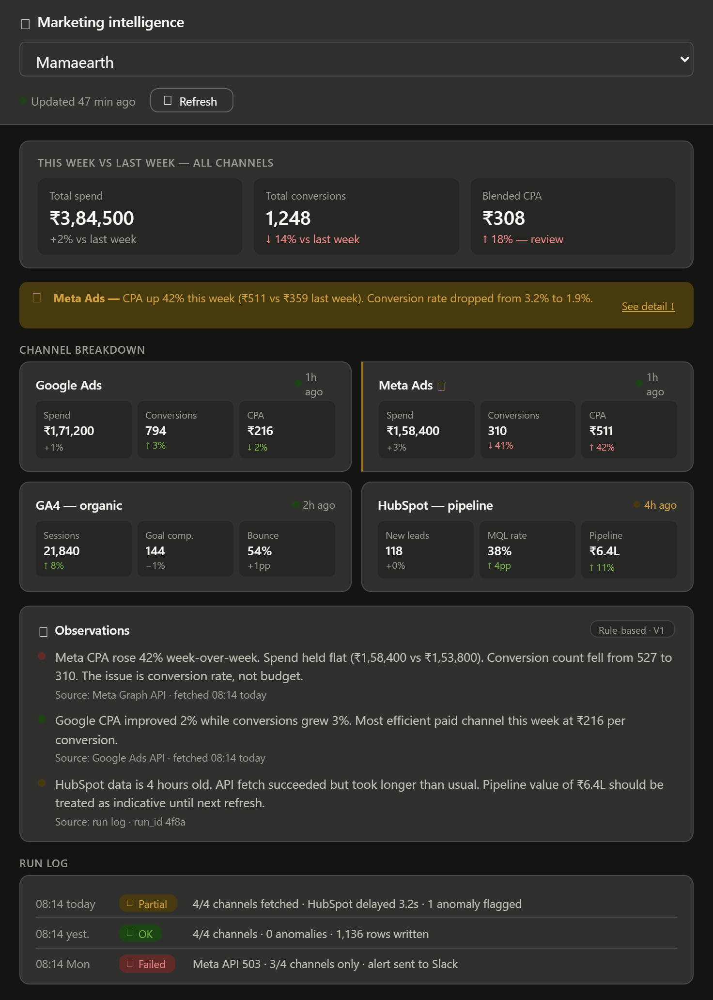
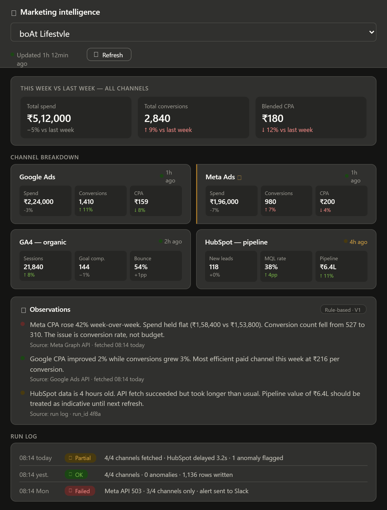
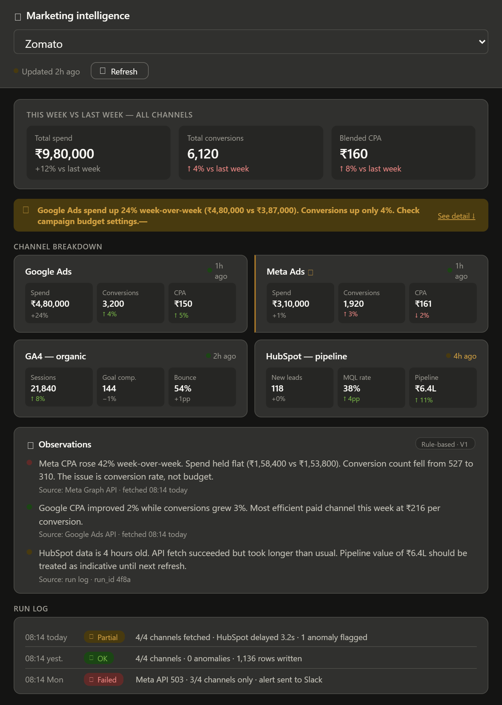

# V1 Wireframe — Marketing Intelligence Digest

The wireframes below show different operational states of the dashboard.
The goal of the UI is operational visibility, not deep analytics exploration.

The dashboard screens were explored iteratively using Claude-assisted prompt
drafting before being refined into the final operational layouts shown below.

---

## State 1 — Cross-channel performance review

The dashboard surfaces weekly performance movement across paid, organic, and
CRM channels in a single operational view. Analysts can quickly compare spend,
conversion efficiency, freshness state, and pipeline movement without drilling
into separate tools.

---

## State 2 — Conversion anomaly detected

A significant shift in conversion efficiency is surfaced directly above the
channel breakdown so the analyst sees the signal before reading detailed
metrics. The interface explains what changed and by how much, without trying
to prescribe actions automatically.

---

## State 3 — Delayed channel refresh

One upstream source refreshed later than expected. The dashboard continues to
serve the latest successful snapshot while exposing freshness state inline so
analysts understand which numbers may be stale during review.

---

## UX decisions — documented

**Summary bar comes first**

The standing question is cross-channel. Three summary metrics answer that first.
Everything below supports those numbers. The layout reflects the operational
question rather than the storage structure underneath.

---

**Anomaly strip appears above channel cards**

If something requires attention, the analyst should see it before reading
individual channel metrics. The signal appears before the detail.

---

**Freshness indicators are inline, not hidden in a footer**

Freshness is attached directly to the channel state so analysts see data age
at the same moment they read the metric. This reduces the risk of treating
stale numbers as current data.

---

**Run log stays visible in the main dashboard**

The dashboard should answer “did the system run correctly today?” without
requiring access to a separate admin panel or engineering tooling.

---

**Observations panel labelled “Rule-based · V1”**

The label intentionally sets expectations. The observations shown here are
threshold and rules-based summaries, not generated reasoning or autonomous
analysis. Future iterations may introduce narrative generation separately.

---

**Three runtime states instead of one static mockup**

Most wireframes only demonstrate the happy path. These states intentionally
cover operational review, anomaly surfacing, and delayed upstream refreshes
because the system needs to remain trustworthy even when data quality or
delivery conditions are imperfect.